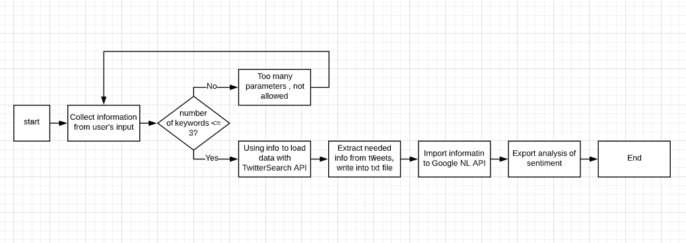

# EC602-Mini-Project-1     

## How to build a our system        
### Environment   
Linux operating system that can run Python program works.      

### Packages needed   
<b> Twitter </b>     
You need to download searchtweets library through Pypi:    
pip install searchtweets               
Or you can install the development version locally via:   
git clone https://github.com/twitterdev/search-tweets-python   
cd search-tweets-python   
pip install -e .     

<b> Google </b>   
Install Google Natural language api for Python       
pip install --upgrade google-cloud-language        

<b> Tkinter </b>   
Package for Python GUI use.   
Just import tkinter or use "from tkinter import * " is fine.

### Steps for building   
1. Download our Python-GUI.py file (then you need to python command to run) / Python - GUI executable file in Python-GUI folder to run directly      
2. Download our Twitter-search.py file    
3. Download our Google sentiment_analysis.py file   
4. Open python-GUI executable file to run   

### User story   
We, Popeyes (a multinational fast-food restaurant chain), want to know the sentiment (score and magnitude) of tweets about our new burger (chicken sandwich) in the time from when we introduced it until now so that we can determine whether to continue this menu item, and if so, whether it needs to be modified to be made better.

We, a small family-owned restaurant, want to know the sentiment of tweets about some of our menu items over the past several weeks so that we can get rid of the least-liked items as we try to streamline our menu.

We, a regional restaurant chain whose biggest competition is a national chain in our region, want to know the sentiment of tweets about some of our competitor's menu items so that we can add better versions of those items to our menu to become the dominant chain in our region.

### Architecture Flowsheet
Start Python GUI App
Collect key information from User's input
Check number of keywords is less than or equal to 3, if so, go to next step; otherwise, go back to ask user type in again
Use input information from user to Load data from needed twitter account through tweepy API    
Extract needed information (people's comments about food) and write into txt file  
Import information to Google Natural Language API   
Export analysis of people's sentiment from Google NL API   
End the program
    
  

